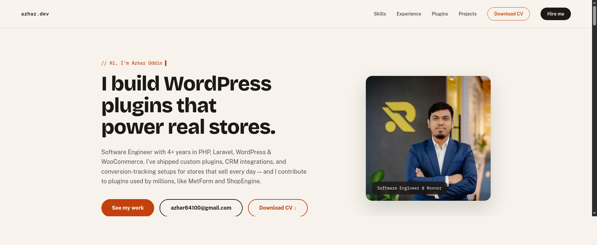

# azhar.dev

Personal portfolio site for Azhar Uddin — Software Engineer specializing in PHP, Laravel, WordPress & WooCommerce plugin development.

Built with Next.js (App Router), React, TypeScript, and Tailwind CSS.



## Tech stack

- [Next.js 14](https://nextjs.org/) — App Router
- [React 18](https://react.dev/) + TypeScript
- [Tailwind CSS](https://tailwindcss.com/)
- Fonts via `next/font/google`: Bricolage Grotesque, Public Sans, IBM Plex Mono

## Getting started

```bash
npm install
npm run dev
```

Open [http://localhost:3000](http://localhost:3000).

Other scripts:

```bash
npm run build   # production build
npm run start   # run the production build
npm run lint    # lint
```

## Project structure

```
app/
  layout.tsx        # root layout, fonts, metadata
  page.tsx           # assembles the homepage from section components
  globals.css         # Tailwind entrypoint + base styles
components/
  Nav.tsx             # sticky nav bar
  Hero.tsx            # intro, headline, CTAs, stats
  TechHighlights.tsx  # tech logo strip
  Skills.tsx          # skill groups
  Experience.tsx      # work history
  Plugins.tsx         # plugins built + Roxnor plugin grid
  Projects.tsx        # live project links
  Contact.tsx         # contact details + footer
  ScrollToTop.tsx      # floating scroll-to-top button
data/
  content.ts          # all page copy/content, typed
public/
  azhar-cv.pdf         # downloadable CV
  images/              # portfolio images
```

Content (stats, skills, jobs, plugins, projects, contact links) lives in [data/content.ts](data/content.ts) — edit that file to update what's shown on the page without touching component markup.
